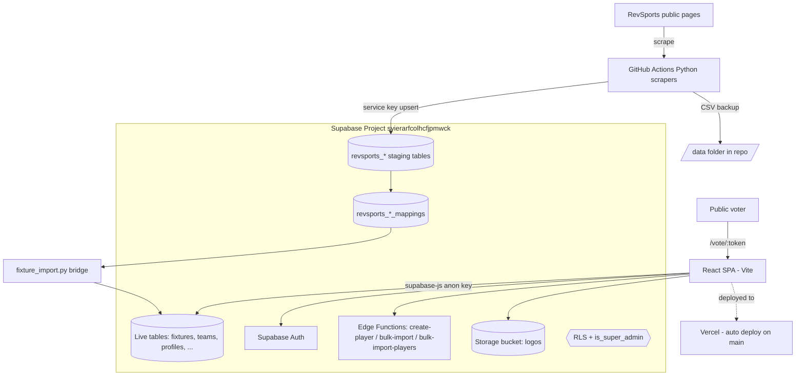
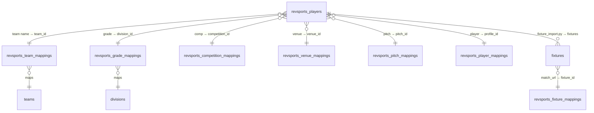

# TECHNICAL SPECIFICATION AND SYSTEM HANDOFF

**Project:** SportStack
**Document purpose:** Complete technical handoff so OpenAI Codex (or any new developer/agent) can take over the project, understand its current state, and make safe changes without re-explanation.
**Prepared:** 15 June 2026
**Source of truth for this document:** Live Supabase database (`svierarfcolhcfjpmwck`) + the actual GitHub repo `SportStackApp/sportstack` (default branch cloned and inspected) + the repo's own `docs/project-brief.md` and `notes/` session handoffs.

> **Marking convention used throughout:**
> **UNKNOWN — needs confirmation** = not verifiable from the database or repo.
> **ASSUMPTION — confirm before implementation** = inferred, treat as a guess until confirmed.
> No real secret values appear anywhere in this document.

---

## 1. Project identity

| Field | Value |
|---|---|
| Project name | **SportStack** (repo/DB use "SportStack"; some user notes say "SportsStack" — see naming note below) |
| Purpose | A private, browser-based sports administration platform that aggregates hockey match/player/fixture data from RevSports (revolutioniseSPORT) into a clean Supabase database, and provides admin, team, and player tooling on top of it. |
| Main users | Association admins, club admins, team managers/coaches, players, umpires, and a super admin (the owner). |
| Main goal | Replace manual spreadsheet/RevSports admin work for regional Victorian hockey associations with one clean system; deliver a Best-on-Ground/MVP voting workflow. |
| Current development stage | Active development / pre-launch. Core data pipeline and admin CRUD exist; voting + several modules are partially built. |
| Production status | Deployed to Vercel (auto-deploy on push to `main`). Treat production data as **real** — 712 profiles, 9,372 scraped player rows, 517 fixtures already exist. |
| Repository | `https://github.com/SportStackApp/sportstack` (GitHub org **SportStackApp**, repo **sportstack**). Clonable without credentials at time of writing. |
| Important domains | `sportstackapp.com`, `sportstackapp.com.au`, `sportstackapp.online`, `grampianshockey.com`, `grampianshockey.com.au` (Hostinger). **UNKNOWN — needs confirmation:** which domain currently serves the live app. |
| Deployment env | Vercel (production = `main`). |
| Local dev env | Windows. Local path per user notes: `C:\Users\mulla\Projects\SportStackApp\sportstack`. Local dev URL `http://localhost:8081` (Vite `server.port` is set to 8081 in `vite.config.ts`). |
| Supabase project | `svierarfcolhcfjpmwck` (dashboard: `https://supabase.com/dashboard/project/svierarfcolhcfjpmwck`). This single project is used for both dev and production. An older project `cdwpecmfzcvgyxjpikxb` appears in some notes but is **not in use**. |

**Naming note (ASSUMPTION — confirm before implementation):** The repo, README, and database all say **SportStack**. Some user-side notes and the local folder path say **SportsStack** / **SportsStackApp**. Treat **SportStack** (one "s") as canonical unless told otherwise.

---

## 2. High-level system overview

### What the app does
1. **Scrapes** public RevSports competition pages (match results, player appearances, season rosters, career history) via scheduled Python scripts running in GitHub Actions.
2. **Stages** that raw data into `revsports_*` tables in Supabase.
3. **Maps** raw RevSports names (teams, clubs, grades, venues, pitches, competitions, players, umpires) to clean internal entities via `revsports_*_mappings` tables.
4. **Imports** mapped data into the native operational tables (`fixtures`, `teams`, `profiles`, etc.) via a bridge script (`fixture_import.py`).
5. **Serves** a React single-page app for admins/teams/players, plus a token-based MVP/Best-on-Ground voting portal.

### Main user flows
- **Admin:** log in → pick mode/scope (Association → Club → Division → Team) → manage entities, fixtures, mappings, users, voting sessions.
- **Player/team:** log in → dashboard → view games, roster, lineup, chat, profile; set availability.
- **Voter (public):** receive a private link `/vote/:token` → cast 3/2/1 Best-on-Ground votes without an account.
- **Umpire:** submit player votes via `/umpire/vote`.

### Main backend flows
- **Auth:** Supabase Auth (email/password + Google SSO). A DB trigger `handle_new_user` creates a `profiles` row when an `auth.users` row is created.
- **Authorisation:** Postgres Row Level Security (RLS) on every public table; a `SECURITY DEFINER` function `is_super_admin()` is the backbone of admin policies.
- **Writes from scrapers:** Python uses the Supabase **service role key** (bypasses RLS) to upsert staging data.
- **Edge Functions:** `create-player`, `bulk-import`, `bulk-import-players` handle privileged player creation/import.

### Main data flow (scrape → live)
```
RevSports site → Python scraper (GitHub Actions) → CSV in /data  +  revsports_players (staging)
                                                                  ↓
                              revsports_*_mappings (name → internal id)
                                                                  ↓
                                 fixture_import.py (bridge) → fixtures / teams / profiles (live)
                                                                  ↓
                                          React app reads live tables via supabase-js
```

### Scheduled jobs / background processes
- **GitHub Actions** (5 workflows): `scrape-hb.yml`, `scrape-sunraysia.yml`, `scrape-wha.yml`, `player-registry.yml`, `player-history.yml`.
- HB/Sunraysia run **daily at 2am AEST** and **hourly 8am–8pm on Sat & Sun** (staggered: HB on the hour, Sunraysia on the half hour). Scheduled runs always upload to Supabase and then run `fixture_import.py`.
- Workflows commit CSV output back into `/data` (with `git pull --rebase -X theirs` before push to avoid conflicts).
- **No Supabase cron jobs (pg_cron) confirmed.** **UNKNOWN — needs confirmation:** MVP voting auto-close currently has no scheduler.

### Admin-only / restricted flows
- All `/admin/*` routes, the RevSports mapping/unmatched screens, bulk import, and MVP voting admin are admin-gated in the UI and by RLS.

### Architecture diagram (Mermaid)


---

## 3. Technology stack

### Frontend
| Concern | Implementation |
|---|---|
| Framework | React 18.3 (SPA) |
| Build tool | Vite 5 (`@vitejs/plugin-react-swc`) |
| Language | TypeScript 5.8 |
| Styling | Tailwind CSS 3.4 + `tailwindcss-animate` + `@tailwindcss/typography` |
| Component library | shadcn/ui (Radix UI primitives), config in `components.json`; UI components in `src/components/ui/` |
| Icons | `lucide-react` |
| Routing | `react-router-dom` v6 (routes defined in `src/App.tsx`) |
| State / data fetching | `@tanstack/react-query` v5; React Context for app state (`AuthContext`, `TeamContext`, `AppModeContext`, `TestRoleContext`) |
| Forms | `react-hook-form` + `@hookform/resolvers` |
| Validation | `zod` |
| Auth handling | Supabase Auth via `@supabase/supabase-js`; session persisted in `localStorage`; route guard `src/components/auth/ProtectedRoute.tsx` |
| API client | Single client `src/integrations/supabase/client.ts`; generated DB types in `src/integrations/supabase/types.ts` |
| File upload | Avatar/logo upload to Supabase Storage `logos` bucket; helper `src/lib/uploadAvatar.ts`; image cropping via `react-easy-crop` / `react-advanced-cropper` |
| Drag & drop | `react-dnd` (+ html5 and touch backends) — used by the lineup feature |
| Charts | `recharts` |
| Toasts | `sonner` + shadcn toaster |
| Spreadsheet | `xlsx` (SheetJS) — for bulk import/export in-browser |

### Backend
SportStack has **no custom Node/Express server**. The "backend" is Supabase:
| Concern | Implementation |
|---|---|
| Runtime | Supabase (managed Postgres + GoTrue auth + PostgREST + Storage + Edge Functions on Deno) |
| API style | PostgREST auto-generated REST/RPC consumed via `supabase-js`; 3 Deno Edge Functions for privileged operations |
| Edge Functions (deployed) | `create-player` (v2), `bulk-import` (v2), `bulk-import-players` (v1) — all `verify_jwt: true` |
| Edge Functions (in repo `supabase/functions/`) | `create-player`, `bulk-import`, `clear-test-data` |
| Auth/authorisation | Supabase Auth + Postgres RLS; `is_super_admin()` SECURITY DEFINER function |
| Validation | Client-side (`zod`); DB-level CHECK constraints (e.g. vote points ∈ {1,2,3}, ratings 1–10) |
| Logging | Supabase dashboard logs; in-app audit tables (`mvp_vote_audit`, `umpire_audit_log`, `rg_audit_log`) |
| Error handling | Client `try/catch` + toasts. **No centralised error reporting (e.g. Sentry) found.** |
| Rate limiting | None in app code (Supabase platform defaults apply). |
| Background jobs | GitHub Actions Python scrapers (see §11). |

> **Mismatch to resolve (UNKNOWN — needs confirmation):** Deployed function `bulk-import-players` has **no matching folder** in `supabase/functions/`, and repo folder `clear-test-data` is **not deployed**. The repo and the live project are out of sync on Edge Functions. Codex should reconcile before editing functions.

### Database
| Concern | Implementation |
|---|---|
| Provider | Supabase (project `svierarfcolhcfjpmwck`) |
| Type | PostgreSQL |
| Tables | 50+ in `public` schema (full list in §7) |
| Views | None found. |
| Functions | `admin_save_user_roles` (4 overloads, SECURITY DEFINER), `handle_new_user` (trigger fn, SD), `is_super_admin()` (SD, no args), `rls_auto_enable` (event trigger, SD), `update_updated_at`, `update_requests_updated_at` |
| Triggers | 12 `BEFORE UPDATE` `updated_at` triggers on key tables (associations, clubs, fixtures, teams, profiles, team_memberships, requests, coach_position_assessments, player_position_preferences, rg_* tables). **ASSUMPTION:** a trigger on `auth.users` runs `handle_new_user` (not visible in `public` schema). |
| RLS | Enabled on all public tables; policies on almost all (see §9). |
| Indexes | Primary keys + several unique constraints (abbreviations, tokens, `fixtures.revsports_match_url`, mapping name columns). Full custom index audit **UNKNOWN — needs confirmation** (not enumerated here). |
| Storage buckets | `logos` (public). |
| Migrations | 19 SQL files in `supabase/migrations/` (Dec 2025 → Apr 2026). Some later schema changes were made directly in the SQL editor and may not be captured as migration files (see §7 known issues). |
| Seed data | `rg_risk_matrix` (25 rows) is reference/seed data. No general seed script found. |

### Hosting and infrastructure
| Concern | Detail |
|---|---|
| Hosting | Vercel (static SPA build + SPA rewrite in `vercel.json`) |
| DNS | Cloudflare (for `barbi.beer` etc.) and/or Hostinger (for sportstackapp/grampianshockey domains). **UNKNOWN — needs confirmation:** which DNS provider fronts the live app. |
| Domain registrar | Hostinger (sportstackapp.*, grampianshockey.*); Cloudflare (barbi.beer). |
| Deployment process | Push to `main` → Vercel auto-build & deploy. |
| Build command | `vite build` (i.e. `npm run build`). |
| Output dir | `dist` (Vite default). |
| Start command | None (static hosting). Local: `npm run dev`. |
| SPA routing | `vercel.json` rewrites all paths to `/index.html`. |
| Preview deployments | **ASSUMPTION:** Vercel preview deploys on non-`main` branches (Vercel default). Confirm. |
| Rollback | Vercel dashboard → redeploy previous deployment. |
| SSL/TLS | Managed by Vercel/Cloudflare. |
| CDN/caching | Vercel edge CDN. |
| Logs/monitoring | Vercel logs + Supabase logs. No external APM found. |

### Third-party services
| Service | Used for | Configured where | Env vars / secrets (names only) | Notes / failure points |
|---|---|---|---|---|
| **Supabase** | Auth, Postgres DB, Storage, Edge Functions, migrations | Supabase dashboard + repo `supabase/` | Frontend: `VITE_SUPABASE_URL`, `VITE_SUPABASE_PUBLISHABLE_KEY`, `VITE_SUPABASE_PROJECT_ID`. Server/CI: `SUPABASE_URL`, `SUPABASE_SERVICE_KEY` (and `SUPABASE_SERVICE_ROLE_KEY` consumed by `fixture_import.py`). | Single project for dev+prod = risky (no isolation). Service key bypasses RLS — never expose. |
| **Vercel** | Hosting/CD of the SPA | Vercel dashboard, `vercel.json` | Same `VITE_*` vars set in Vercel project settings. | Auto-deploy on `main` means an unstable `main` ships immediately. |
| **GitHub** | Source control + Actions (scrapers/CI) | `.github/workflows/` | Actions secrets: `SUPABASE_URL`, `SUPABASE_SERVICE_KEY` | Concurrent workflow runs need rebase-before-push (already handled). |
| **GitHub Actions** | Scheduled scrapers + fixture import | 5 workflow YAMLs | as above | Node 24 deprecation handled via `FORCE_JAVASCRIPT_ACTIONS_TO_NODE24`. |
| **RevSports (revolutioniseSPORT)** | Upstream data source (scraped) | `PORTAL_URL` env in workflows | none (public pages); WHA player match cards are login-protected | Site HTML changes break scrapers; WHA player data needs credentials. |
| **Hostinger** | Domain registration (sportstackapp.*, grampianshockey.*) | Hostinger panel | none in repo | DNS records **UNKNOWN**. |
| **Cloudflare** | DNS / CDN for some domains | Cloudflare dashboard | none in repo | **UNKNOWN** which domains route through it for the app. |
| **Google OAuth** | Google SSO login | Supabase Auth providers + Google Cloud console | configured in Supabase, not repo | Redirect URLs must include production URL (README note). |
| **Email/SMS provider (e.g. Resend)** | Voting trigger + reminder emails | **Not implemented yet** | **UNKNOWN** | `mvp_vote_tokens` has `email_sent_at` / `reminder_*` columns but no sending code found. PLANNED. |
| **Activepieces** (`activepieces.barbi.beer`) | Automation (connected as an MCP/connector for the owner) | external | n/a | Not referenced in repo. Role TBD. |
| **Zapier** | Automation (connector) | external | n/a | Not referenced in repo. |
| **Docker / QNAP NAS** | Owner's local infra | external | n/a | Not part of the deployed app. |
| **Stripe** | — | — | — | **Not present.** No payments. |

---

## 4. Repository structure

```
sportstack/
├── .github/
│   └── workflows/                # CI: scrapers + fixture import
│       ├── scrape-hb.yml
│       ├── scrape-sunraysia.yml
│       ├── scrape-wha.yml
│       ├── player-registry.yml
│       └── player-history.yml
├── data/                         # CSV output committed by scrapers (generated)
│   ├── hockey-ballarat/
│   ├── sunraysia/
│   ├── player-registry/
│   ├── player-history/
│   └── _test/
├── docs/
│   └── project-brief.md          # ★ existing Codex-oriented brief — READ FIRST
├── notes/                        # session handoffs + known issues (★ valuable history)
│   ├── known-issues.md
│   ├── project-consolidation-notes.md
│   ├── session-2026-04-15.md ... session-2026-06-05-data-alignment.md
│   └── session-4-handover.md / session-4-todo.md
├── public/                       # static assets
├── scraper/                      # ★ Python data pipeline
│   ├── scraper.py                # main match scraper (HB + generic), ~50KB
│   ├── history_scraper.py        # career stats → revsports_player_history
│   ├── player_registry_scraper.py# season rosters → revsports_player_registry
│   └── fixture_import.py         # bridge: staging/mappings → fixtures table
├── src/
│   ├── App.tsx                   # ★ all routes + provider tree
│   ├── main.tsx
│   ├── index.css / App.css
│   ├── assets/
│   ├── components/
│   │   ├── admin/                # ScopedTeamSelector
│   │   ├── auth/                 # ProtectedRoute
│   │   ├── entity/ layout/ lineup/ profile/
│   │   ├── ui/                   # shadcn components (avoid editing wholesale)
│   │   ├── NavLink.tsx ThemeToggle.tsx
│   ├── contexts/                 # AuthContext, TeamContext, AppModeContext, TestRoleContext
│   ├── hooks/                    # useUserRole.ts, useAdminScope.ts, use-mobile, use-toast
│   ├── integrations/supabase/    # client.ts (generated), types.ts (generated DB types)
│   ├── lib/                      # utils.ts, uploadAvatar.ts, mockData.ts
│   └── pages/
│       ├── admin/                # 17 admin screens (see §5 / Doc 2)
│       ├── coaching/             # CoachingSquad, CoachingPlayerProfile
│       ├── umpire/               # UmpireVoteSubmit
│       └── *.tsx                 # Dashboard, Games, GameDetail, Lineup, Roster, Chat,
│                                 # Profile, VotingPortal, Landing, Login, Signup, etc.
├── supabase/
│   ├── migrations/               # 19 SQL migration files
│   ├── functions/                # bulk-import, create-player, clear-test-data (Deno)
│   └── .temp/
├── index.html
├── package.json                  # scripts: dev, build, build:dev, lint, preview
├── vite.config.ts                # port 8081, @ alias → ./src
├── tailwind.config.ts / postcss.config.js / components.json
├── tsconfig*.json / eslint.config.js
├── vercel.json                   # SPA rewrite
├── bun.lock / bun.lockb          # ⚠ Bun lockfiles present
├── package-lock.json             # ⚠ npm lockfile ALSO present
└── test_*.js (root)              # ⚠ old investigation scripts (test_divisions.js, etc.)
```

**Entry points:** `index.html` → `src/main.tsx` → `src/App.tsx`.
**Files Codex should avoid changing unless explicitly asked:** `src/components/ui/*` (generated shadcn), `src/integrations/supabase/client.ts` and `types.ts` (auto-generated — regenerate, don't hand-edit), `supabase/migrations/*` (append new migrations, never rewrite history), `data/*` (scraper output), `bun.lock*` / `package-lock.json`.
**Files to review/clean (tech debt):** root `test_*.js`, `src/lib/mockData.ts`, `src/test_ts.ts`.

---

## 5. Environment variables and secrets

> Real values are **never** committed (`.env` and `.env.local` are git-ignored). Create `.env.example` from the table below.

### `.env.example` (proposed)
```dotenv
# ── PUBLIC FRONTEND (safe to expose to browser; baked into the build) ──
VITE_SUPABASE_URL=https://<project-ref>.supabase.co
VITE_SUPABASE_PUBLISHABLE_KEY=<supabase-anon-or-publishable-key>
VITE_SUPABASE_PROJECT_ID=<project-ref>

# ── SERVER / CI ONLY (NEVER expose to the browser, never prefix with VITE_) ──
# Used by Python scrapers and GitHub Actions:
SUPABASE_URL=https://<project-ref>.supabase.co
SUPABASE_SERVICE_KEY=<service-role-key>          # bypasses RLS — secret
# fixture_import.py expects this name specifically:
SUPABASE_SERVICE_ROLE_KEY=<service-role-key>     # same value as above

# ── SCRAPER RUNTIME (set per workflow, not secret) ──
PORTAL_URL=https://www.revolutionise.com.au/<association-slug>
ASSOCIATION_NAME=Hockey Ballarat
OUTPUT_DIR=data/hockey-ballarat
UPSERT_SUPABASE=false        # 'true' only on scheduled runs / when intended
ONLY_GRADES=
ONLY_ROUNDS=
ONLY_TEAM=

# ── EMAIL (PLANNED — not yet implemented) ──
# RESEND_API_KEY=<...>       # UNKNOWN — confirm provider before adding
```

| Variable | Required | Local pattern | Prod pattern | Used by | Safe in frontend? | Notes |
|---|---|---|---|---|---|---|
| `VITE_SUPABASE_URL` | Yes | `.env.local` | Vercel env | React client | **Yes** | Public project URL |
| `VITE_SUPABASE_PUBLISHABLE_KEY` | Yes | `.env.local` | Vercel env | React client | **Yes** (anon key, RLS-protected) | Do not confuse with service key |
| `VITE_SUPABASE_PROJECT_ID` | Yes (per README) | `.env.local` | Vercel env | tooling | Yes | |
| `SUPABASE_URL` | Yes (CI) | shell/CI | GitHub secret | scrapers, fixture_import | n/a | |
| `SUPABASE_SERVICE_KEY` | Yes (CI) | shell/CI | GitHub secret | scrapers | **NO — server-only** | Full DB access |
| `SUPABASE_SERVICE_ROLE_KEY` | Yes (CI) | shell/CI | mapped from `SUPABASE_SERVICE_KEY` | `fixture_import.py` | **NO** | Naming mismatch with the secret — see §13 |
| `RESEND_API_KEY` (or other) | Future | — | — | email (planned) | NO | **UNKNOWN** |

---

## 6. Setup instructions for Codex and developers

> Package manager note: the repo contains **both** Bun and npm lockfiles. README says npm. **ASSUMPTION — confirm:** use **npm** as the canonical manager and remove `bun.lock*`, OR standardise on Bun and remove `package-lock.json`. Until confirmed, prefer npm.

```bash
# 1. Clone
git clone https://github.com/SportStackApp/sportstack.git
cd sportstack

# 2. Install dependencies (npm canonical)
npm install

# 3. Local env file (ask the owner for values; never commit)
cp .env.example .env.local      # then fill in VITE_SUPABASE_* values

# 4. Run the app locally (http://localhost:8081)
npm run dev

# 5. Lint
npm run lint

# 6. Type check
npx tsc --noEmit                 # (no dedicated "typecheck" script exists yet)

# 7. Production build
npm run build                    # outputs to dist/

# 8. Preview the production build
npm run preview

# 9. Tests
#    UNKNOWN — no test framework installed. See §12. Discover with: grep -i "vitest\|jest" package.json
```

### Database migrations (Supabase)
```bash
# UNKNOWN — confirm whether the Supabase CLI is used locally.
# If using the CLI: supabase db push   (applies supabase/migrations/*)
# In practice many changes are made via the Supabase SQL editor or the MCP
#   apply_migration (DDL) / execute_sql (DML) tooling. Reconcile drift before relying on CLI.
```

### Seeding data
- No general seed script. `rg_risk_matrix` reference rows are expected to be present.
- **Do not** seed by re-running destructive resets against production.

### Running the scrapers / import locally (Windows examples from owner notes)
```powershell
# Load env vars into the PowerShell session first:
$env:SUPABASE_URL = [System.Environment]::GetEnvironmentVariable("SUPABASE_URL","User")
$env:SUPABASE_SERVICE_KEY = [System.Environment]::GetEnvironmentVariable("SUPABASE_SERVICE_KEY","User")

# Match scraper (set UPSERT_SUPABASE=false to NOT write to the DB while testing):
$env:PORTAL_URL="https://www.revolutionise.com.au/hockeyballarat"
$env:ASSOCIATION_NAME="Hockey Ballarat"
$env:OUTPUT_DIR="data/hockey-ballarat"
$env:UPSERT_SUPABASE="false"
python scraper/scraper.py

# Fixture import bridge (needs SUPABASE_SERVICE_ROLE_KEY):
$env:SUPABASE_SERVICE_ROLE_KEY = $env:SUPABASE_SERVICE_KEY
python scraper/fixture_import.py
```
Python deps: `pip install requests beautifulsoup4 supabase`. Owner's Python: `C:/Python314/python.exe` (CI uses Python 3.11).

### Resetting local state safely
- Local app keeps no server state (it talks to the shared Supabase project). **There is no separate dev database** — be extremely careful: local runs hit production data. **Confirm before any destructive script** (e.g. `clear-test-data`).

---

## 7. Database handoff

### 7.1 Live table inventory (public schema, with row counts at handoff)

| Table | Rows | Purpose |
|---|---|---|
| `associations` | 3 | Top-level orgs (HB, SHA, WHA) |
| `clubs` | 19 | Clubs within associations |
| `seasons` | 4 | Season/competition periods |
| `competitions` | 3 | Competitions (links season ↔ association) |
| `divisions` | 21 | Grades/divisions (has `competition_id`, `season_id`, age bounds) |
| `teams` | 87 | Teams (club + division + optional home venue) |
| `team_divisions` | 87 | Team↔division↔season join (preferred source of a team's division) |
| `venues` | 10 | Grounds |
| `pitches` | 19 | Pitches within venues |
| `venue_associations` | 11 | Venue↔association + allowed pitches |
| `profiles` | 712 | User/person profiles (FK → `auth.users`); 678 placeholder, 34 real |
| `user_roles` | 665 | Role grants scoped to assoc/club/team |
| `team_memberships` | 1,212 | Player↔team membership (type + status) |
| `fixtures` | 517 | Games (scores, status, round) |
| `fixture_availability` | 3 | Player availability per fixture |
| `lineups` | 0 | Lineup planner rows (built, unused) |
| `requests` | 3 | Player/team join requests |
| `primary_change_requests` | 1 | Requests to change a player's primary team |
| `notifications` / `notification_preferences` | 0 / 0 | In-app notifications (unused) |
| `team_messages` | 0 | Team chat (unused) |
| **MVP voting** | | |
| `mvp_voting_sessions` | 2 | One voting session per game |
| `mvp_vote_tokens` | 0 | Private voting links (+ email_sent/reminder timestamps) |
| `mvp_votes` | 0 | Vote lines (points ∈ {1,2,3}) |
| `mvp_vote_audit` | 0 | Admin change audit |
| `mvp_tokens` | 0 | Legacy/older token table (likely superseded) |
| **Umpire voting** | | |
| `umpire_rounds` / `umpire_fixtures` | 0 / 0 | Umpire scheduling |
| `umpire_vote_submissions` / `umpire_vote_lines` / `umpire_vote_edits` | 0 / 0 / 0 | Umpire→umpire ratings (1–10) |
| `umpire_guests` | 0 | Token-based guest umpires |
| `umpire_audit_log` | 0 | Audit |
| **Player vote (legacy umpire portal migration)** | | |
| `player_vote_submissions` | 2 | Migrated player-vote submissions |
| `player_vote_lines` | 3 | Vote lines (votes ∈ {1,2,3}) |
| `player_vote_edits` | 0 | Edit audit |
| **Coaching** | | |
| `player_position_preferences` | 0 | Player position prefs (1–4) |
| `coach_position_assessments` | 0 | Coach assessments (1–4) |
| **RevSports staging** | | |
| `revsports_players` | 9,372 | Scraped match/player appearances (wide table, ~48 cols) |
| `revsports_player_registry` | 742 | Season rosters |
| `revsports_player_history` | 4,014 | Career stats by season |
| `revsports_unmatched_items` | 0 | Items that failed mapping |
| **RevSports mappings** | | |
| `revsports_team_mappings` | 169 | `revsports_team_name` → `team_id` |
| `revsports_player_mappings` | 1,638 | player name → `profile_id` |
| `revsports_club_mappings` | 10 | club name → `club_id` |
| `revsports_grade_mappings` | 16 | grade → `division_id` |
| `revsports_venue_mappings` | 11 | venue → `venue_id` |
| `revsports_pitch_mappings` | 10 | pitch → `pitch_id` |
| `revsports_competition_mappings` | 3 | competition → `competition_id` (note: FK targets `seasons`) |
| `revsports_association_mappings` | 0 | association name → `association_id` |
| `revsports_umpire_mappings` | 3 | umpire name → `profile_id` |
| `revsports_fixture_mappings` | 0 | match url → `fixture_id` |
| **Risk/Governance ("rg_" suite)** | | |
| `rg_risk_register` | 0 | Risk register (likelihood×consequence) |
| `rg_risk_matrix` | 25 | 5×5 risk matrix reference data |
| `rg_risk_reviews` | 0 | Risk reviews |
| `rg_be_smart_actions` | 0 | Mitigation actions |
| `rg_quality_improvement_items` | 0 | QI items |
| `rg_comments` | 0 | Generic comments |
| `rg_audit_log` | 0 | Audit |
| `rg_dropdown_values` / `rg_risk_guidance_sections` | 0 / 0 | Config/help content |

> **Note on the `rg_*` suite:** This is a risk/governance module (likely related to the owner's day-job context, Grampians Community Health). It has full schema + RLS but ~zero data. **ASSUMPTION:** parked/secondary; confirm whether it is in scope for SportStack or a separate concern bundled into the same DB.

### 7.2 Enums (live)
| Enum | Values |
|---|---|
| `user_role_enum` | SUPER_ADMIN, ASSOCIATION_ADMIN, CLUB_ADMIN, TEAM_MANAGER, COACH, PLAYER, **UMPIRE, VOTER, UMPIRE_ADMIN** |
| `membership_type_enum` | PRIMARY, PERMANENT, FILL_IN, SECONDARY |
| `membership_status_enum` | ACTIVE, INACTIVE, PENDING, INVITED, CANCELLED |
| `fixture_status_enum` | SCHEDULED, IN_PROGRESS, COMPLETED, CANCELLED, POSTPONED, INCOMPLETE |
| `availability_status_enum` | AVAILABLE, UNAVAILABLE, MAYBE, NO_RESPONSE |
| `request_status_enum` | PENDING, APPROVED, DECLINED, CANCELLED |
| `request_type_enum` | PLAYER_REQUEST, TEAM_INVITE |
| `mvp_session_status` | PENDING, OPEN, CLOSED |
| `risk_status_enum` | OPEN, IN_PROGRESS, RESOLVED, CLOSED, ACCEPTED |
| `action_status_enum` | PENDING, IN_PROGRESS, COMPLETED, OVERDUE |

> **Important:** The user notes said "6 roles" but the live enum has **9**. Treat the live enum as truth. Postgres enums cannot be renamed; add values with `ALTER TYPE ... ADD VALUE IF NOT EXISTS` then `UPDATE` rows.

### 7.3 Functions, triggers
- **`is_super_admin()`** — SECURITY DEFINER, **takes no arguments** (uses `auth.uid()`); used in RLS policies. Never pass a user id.
- **`admin_save_user_roles(...)`** — SECURITY DEFINER, 4 overloads; the privileged path to set a user's roles.
- **`handle_new_user()`** — trigger function (SD) that creates a `profiles` row for new auth users.
- **`rls_auto_enable()`** — event trigger that auto-enables RLS on new tables.
- **`update_updated_at()` / `update_requests_updated_at()`** — timestamp triggers.
- **12 `BEFORE UPDATE` triggers** maintain `updated_at` on core tables.

### 7.4 Key relationships (Mermaid ERD — core slice)
```mermaid
erDiagram
    associations ||--o{ clubs : has
    associations ||--o{ seasons : has
    associations ||--o{ competitions : has
    associations ||--o{ divisions : has
    associations ||--o{ venues : has
    seasons ||--o{ competitions : contains
    competitions ||--o{ divisions : groups
    clubs ||--o{ teams : fields
    divisions ||--o{ teams : classifies
    teams ||--o{ team_divisions : seasonal
    divisions ||--o{ team_divisions : seasonal
    venues ||--o{ pitches : has
    teams ||--o{ fixtures : "home/away"
    divisions ||--o{ fixtures : (nullable)
    seasons ||--o{ fixtures : (nullable)
    venues ||--o{ fixtures : at
    profiles ||--o{ user_roles : granted
    profiles ||--o{ team_memberships : member
    teams ||--o{ team_memberships : roster
    fixtures ||--o{ mvp_voting_sessions : voting
    mvp_voting_sessions ||--o{ mvp_vote_tokens : issues
    mvp_voting_sessions ||--o{ mvp_votes : records
    revsports_players ||--o{ mvp_vote_tokens : "voter player"
    profiles }o--|| auth_users : "id FK"
```

### 7.5 RevSports pipeline ERD (Mermaid)


### 7.6 Known data issues (live, verified at handoff)
| Issue | Evidence | Impact |
|---|---|---|
| **`division_id` NULL on ALL 517 fixtures** | `SELECT count(*) FROM fixtures WHERE division_id IS NULL` = 517 | Any join `fixtures → divisions → associations` returns zero rows. `fixture_import.py` is not setting it. |
| **`season_id` NULL on ALL 517 fixtures** | same query for season_id = 517 | Fixtures not attributable to a season; ladder/season views break. |
| **`revsports_players.profile_id` linked = 0** | `count WHERE profile_id IS NOT NULL` = 0 | Scraped players are not yet linked to real profiles → MVP voting player-matching incomplete. |
| **678 of 712 profiles are placeholders** | `is_placeholder = true` | Most "users" are scraped stubs (`player.[id]@placeholder.sportstack.com.au`), not real logins. |
| **`revsports_competition_mappings` FK targets `seasons`, not `competitions`** | FK `..._competition_id_fkey → seasons.id` | Naming is misleading; confirm intended target before changing import logic. |
| **`revsports_player_registry` / `revsports_player_history` have RLS enabled but no policies** | absent from `pg_policies` | Frontend (anon/auth) cannot read them; only service role can. Confirm if intentional. |
| **Reliable joins from `fixtures`** | FKs present | Join directly to `teams` via `home_team_id`/`away_team_id`. Avoid division/season joins until fixed. |
| **Schema drift** | notes say some changes made in SQL editor | `supabase/migrations/` may not fully reproduce the live schema. |

### 7.7 Required Supabase objects (for a fresh environment)
- Buckets: `logos` (public).
- Edge functions: `create-player`, `bulk-import`, `bulk-import-players` (+ reconcile `clear-test-data`).
- Functions: `is_super_admin()`, `admin_save_user_roles`, `handle_new_user`, `rls_auto_enable`, `update_updated_at`.
- Auth providers: Email/password + Google OAuth (redirect URLs configured).
- Cron jobs: **None confirmed.** MVP auto-close scheduler is **PLANNED**.

---

## 8. API handoff

There is **no bespoke HTTP API**. Data access is:
1. **PostgREST via `supabase-js`** — table reads/writes governed by RLS.
2. **RPC** — Postgres functions callable via `supabase.rpc(...)`.
3. **Edge Functions** — privileged operations.

### 8.1 RPC functions
| Function | Purpose | Auth | Authorisation | Side effects | Related tables | Notes |
|---|---|---|---|---|---|---|
| `is_super_admin()` | Returns whether `auth.uid()` is super admin | session JWT | self | none | `user_roles` | No args. Used inside RLS. |
| `admin_save_user_roles(...)` | Set a user's role grants | session JWT | super/assoc admin (enforced in fn) | writes `user_roles` | `user_roles` | 4 overloads — **UNKNOWN — confirm exact signatures** before calling. |

### 8.2 Edge Functions
| Function | Method | Purpose | Auth | Request (ASSUMPTION) | Side effects | Related tables | Frontend caller (ASSUMPTION) |
|---|---|---|---|---|---|---|---|
| `create-player` | POST | Create a player profile/account | JWT (`verify_jwt: true`) | `{ player fields }` | inserts `profiles` (+ maybe `auth.users`, `team_memberships`) | `profiles`, `team_memberships` | `src/pages/admin/AddPlayer.tsx` |
| `bulk-import` | POST | Bulk import entities | JWT | `{ rows[] }` | bulk inserts | multiple | `src/pages/admin/BulkImport.tsx` |
| `bulk-import-players` | POST | Bulk import players specifically | JWT | `{ players[] }` | bulk inserts profiles | `profiles`, `team_memberships` | `BulkImport.tsx` (**UNKNOWN — confirm**) |

> Request/response bodies are **ASSUMPTION** — read `supabase/functions/<name>/index.ts` to confirm exact contracts. Known bugs/gaps: bulk import should **not** send invitation emails (per project brief); `bulk-import-players` deployed but missing from repo (sync gap).

---

## 9. Authentication and permissions

| Aspect | Detail |
|---|---|
| Login | Email + password, and **Google SSO** (Supabase Auth). |
| Signup | `/signup`; new auth user → `handle_new_user` trigger creates a `profiles` row. New users may land on `/pending` until granted a role. |
| Profiles ↔ auth | `profiles.id` is a hard FK to `auth.users.id`. **You cannot insert a profile without a real auth user** — placeholder profiles exist because they were created with the service role/Edge Function. |
| Roles | `user_roles` rows, each with a `role` (enum) scoped by `association_id` / `club_id` / `team_id`. A user can hold multiple roles at different scopes. |
| Role hierarchy | Managed in `src/hooks/useUserRole.ts` (`ROLE_HIERARCHY`, `getRoleDisplayName`, `getRoleEmoji`, `getRoleBadgeColor`). Update all four when adding a role. |
| Admin scope | `src/hooks/useAdminScope.ts` + `AppModeContext`/`TeamContext` implement the Association→Club→Division→Team cascade. Switching a level must reset all levels below it. |
| Frontend route protection | `src/components/auth/ProtectedRoute.tsx` wraps protected + admin routes. Public routes: `/`, `/login`, `/signup`, `/forgot-password`, `/reset-password`, `/pending`, `/vote/:token`. |
| Backend permission checks | RLS on every table; `is_super_admin()` central; mapping/admin tables use `ALL`-command policies gated to admins; public-readable reference tables use `SELECT` policies. |
| User ↔ records | via `user_roles` (scope) and `team_memberships` (roster). |
| How to test permissions | `TestRoleContext` allows simulating roles in dev. Verify each role sees only its scope; verify anon can read only what `SELECT` policies allow; verify service-key operations stay server-side. |
| Known security gaps | Single Supabase project for dev+prod; service key used in CI (must stay secret); two tables (`revsports_player_registry/history`) RLS-on-zero-policies (read-blocked, confirm intent); `vite.config.ts` hardcodes an ngrok host in `allowedHosts` (review). |

---

## 10. Email and notification system

**Status: largely PLANNED / not implemented.**

| Aspect | Detail |
|---|---|
| Email provider | **UNKNOWN — not implemented.** No Resend (or other) SDK in `package.json`, no email-sending Edge Function found. Owner notes list "email provider setup" as outstanding. |
| Sending domain / from / reply-to | **UNKNOWN.** Likely a `sportstackapp.com.au` address once set up. |
| Templates | None in repo. |
| Triggering events (planned) | MVP voting: send private vote link on session open; reminders at 48h and 24h (columns `email_sent_at`, `reminder_48h_sent_at`, `reminder_24h_sent_at` exist on `mvp_vote_tokens`). |
| In-app notifications | `notifications` + `notification_preferences` tables exist but are empty and unwired. |
| Delivery logs / webhooks / bounce / unsubscribe | **UNKNOWN — not implemented.** |
| Required DNS records | **UNKNOWN** (SPF/DKIM/DMARC needed once a provider is chosen). |
| Test process | N/A yet. |

---

## 11. Deployment and CI/CD

| Aspect | Detail |
|---|---|
| App deployment | Vercel auto-deploys on push to `main`. Build `vite build` → `dist`. SPA rewrite in `vercel.json`. |
| Branch strategy (owner convention) | **`.github/workflows/*.yml` → commit directly to `main`.** All other changes (code/scraper/frontend) → `dev` first, then merge to `main` to deploy. |
| GitHub Actions | 5 scraper workflows. Pattern per workflow: checkout → setup Python 3.11 → `pip install requests beautifulsoup4 supabase` → run scraper (writes CSV + optional Supabase upsert) → commit CSV back to `/data` (`git pull --rebase -X theirs` then push) → run `fixture_import.py` when uploading. |
| Schedules | HB & Sunraysia: daily 2am AEST + hourly 8am–8pm Sat/Sun (HB on :00, Sunraysia on :30). player-registry / player-history: **UNKNOWN — confirm their cron** (separate workflows). |
| Node 24 fix | `FORCE_JAVASCRIPT_ACTIONS_TO_NODE24: true` env (June 2026 deprecation). |
| Required CI secrets | `SUPABASE_URL`, `SUPABASE_SERVICE_KEY`. |
| Build/test/lint/type checks in CI | **None for the app.** No CI step runs `npm run build`, `lint`, or `tsc`. (Risk — see §13.) |
| Preview deploys | Vercel default (ASSUMPTION). |
| Release/rollback | Vercel dashboard redeploy. |
| Current risks | Unstable `main` ships instantly; scrapers write to production with the service key; no build gate. |

---

## 12. Testing and quality checks

| Aspect | Detail |
|---|---|
| Test framework | **None installed.** No vitest/jest/playwright in `package.json`. |
| Existing "tests" | Root `test_*.js` are ad-hoc investigation scripts (Supabase REST probing), not a suite. |
| Missing | Unit, integration, and E2E tests all absent. |
| Lint | `eslint .` (`npm run lint`) works. |
| Type check | `npx tsc --noEmit` (no script alias yet). |
| Accessibility / mobile / performance checks | None automated. Manual only. |
| DB safety | No automated guard; destructive scripts (`clear-test-data`) must be run manually with care. |

### "Codex must run these before submitting work"
```bash
npm run lint          # must pass (no new errors)
npx tsc --noEmit      # must pass (no type errors)
npm run build         # must succeed
```
Plus the relevant manual smoke test from Doc 2 §12.

---

## 13. Known bugs, risks, and technical debt

| Issue | Area | Severity | Current impact | Likely cause | Suggested fix | Files likely involved | Safe first step | Test required |
|---|---|---|---|---|---|---|---|---|
| `division_id` NULL on all fixtures | DB/Pipeline | High | division/season joins return 0 rows | `fixture_import.py` not resolving via `revsports_grade_mappings` | populate `division_id` during import; backfill existing 517 | `scraper/fixture_import.py`, migration | Read import script, log a dry-run mapping count | Re-run import on a copy; assert non-null counts |
| `season_id` NULL on all fixtures | DB/Pipeline | High | season views broken | import not resolving via `revsports_competition_mappings` | populate `season_id` during import; backfill | `scraper/fixture_import.py` | same | same |
| RevSports players not linked to profiles (0 links) | Pipeline/Voting | High | MVP voting matching incomplete | player-matching step not run | run/finish `revsports_player_mappings` → set `revsports_players.profile_id` | `scraper/*`, mapping admin pages | audit unmatched players | verify link counts |
| No build/lint gate in CI | CI/CD | High | broken code can deploy to prod | no workflow runs build | add a GitHub Action: `npm ci && npm run lint && tsc --noEmit && npm run build` on PRs to `main` | new `.github/workflows/ci.yml` | add non-blocking check first | PR triggers check |
| Single Supabase project for dev+prod | Infra | High | local/test work can corrupt prod | cost/simplicity | create a separate dev project or use branches; gate destructive scripts | env config, scrapers | document the risk; add confirmation prompts | n/a |
| Edge function repo↔deploy drift | Backend | Medium | unclear source of truth | manual deploys | reconcile `clear-test-data` (repo only) and `bulk-import-players` (deployed only) | `supabase/functions/*` | diff repo vs deployed | function smoke test |
| Two lockfiles (bun + npm) | Tooling | Medium | inconsistent installs | scaffold + later changes | pick one (npm per README), delete the other | `bun.lock*`, `package-lock.json` | confirm with owner | `npm ci` clean install |
| `AssociationsManagement.tsx` stray `>` ~line 727 after patches | Frontend | Medium | render/compile breakage | AI patch artefact | check after any edit to this file | `src/pages/admin/AssociationsManagement.tsx` | grep for stray `>` | `tsc`/build |
| RLS-on-zero-policies on registry/history | Security/Data | Medium | frontend can't read those tables | policies never added | add explicit `SELECT` policy or confirm server-only | migration | confirm intent | RLS test as anon/auth |
| Hardcoded ngrok host in `vite.config.ts` allowedHosts | Config | Low | stale dev config | leftover | parameterise or remove | `vite.config.ts` | confirm not needed | dev server starts |
| `mvp_tokens` legacy vs `mvp_vote_tokens` | DB | Low | duplicate concepts | iteration | confirm `mvp_tokens` is dead, then drop | migration | check references in code | grep usage |
| Root `test_*.js`, `mockData.ts`, `test_ts.ts` | Cleanliness | Low | clutter/confusion | investigation leftovers | review then remove | repo root, `src/lib` | confirm unused | build still passes |
| SUPER_ADMIN seed row disappears | DB | Medium | owner loses super-admin intermittently | unknown deletion path | add idempotent seed migration | migration | reproduce, add seed | login as super admin |
| Duplicate team names in fixture import | Pipeline | Medium | wrong team assignment, silent | non-unique names within association | import preview warning (Option C in notes) | `scraper/fixture_import.py`, `FixtureImport.tsx` | add duplicate detection log | import dry-run |

---

## 14. Security review

| Risk area | Finding | Recommended fix |
|---|---|---|
| Secret exposure | Service role key used in CI/scrapers — full DB access. Frontend correctly uses only anon/publishable key. | Keep service key only in GitHub/Vercel secrets; never log; never prefix with `VITE_`. Rotate if ever pasted anywhere. |
| Client/server boundary | All privileged work is in Edge Functions / service-key scripts — good. | Ensure no service key path is ever bundled into the SPA. |
| RLS | Enabled everywhere; two staging tables have no policies (read-blocked). | Confirm intent; add explicit policies where the frontend must read. |
| Admin privilege | `is_super_admin()` + `admin_save_user_roles` are SECURITY DEFINER. | Review function bodies to ensure they re-check the caller's privilege. |
| File upload | `logos` bucket is **public**. | Ensure only admins can write; validate file type/size client+policy side. |
| API abuse | No app-level rate limiting. | Rely on Supabase limits; consider per-token throttling on the public `/vote/:token` flow. |
| Email abuse | Not built yet. | When adding, use server-side sending only and per-token guards. |
| Webhook validation | None present. | If adding (e.g. email provider), verify signatures. |
| Dependency risk | Large Radix/shadcn surface; no automated audit. | Add `npm audit` / Dependabot. |
| Public voting token | Tokens are 32-byte random hex (`gen_random_bytes`). | Good; ensure tokens expire and single-use is enforced server-side. |
| Single prod project | dev work hits prod. | Separate environments. |

---

## 15. Codex operating instructions

**How to approach the repo**
1. Read `docs/project-brief.md` (the owner's existing brief) and the latest files in `notes/`.
2. Read this document and Doc 2.
3. Inspect `src/App.tsx` (routes), `src/integrations/supabase/types.ts` (DB types), `src/hooks/useUserRole.ts` and `useAdminScope.ts` (roles/scope), and `scraper/fixture_import.py` (pipeline).
4. Confirm the live schema against §7 before any DB change (it is the source of truth; migrations may have drifted).

**What to inspect first:** routes, contexts/providers, the Supabase client, the role hooks, and the fixture import script.

**Files to avoid editing unless asked:** `src/components/ui/*`, `src/integrations/supabase/client.ts` & `types.ts` (regenerate instead), existing `supabase/migrations/*` (append only), `data/*`, lockfiles.

**Making small safe changes**
- One concern per branch/PR. Don't refactor unrelated code "for neatness."
- Reuse existing shadcn components and app patterns.
- Keep user-facing text in **Australian English**.
- Never read, print, or expose `.env` / `.env.local`.

**Branches & commits (owner convention)**
- Workflow YAML changes → branch off and PR to `main` (or commit to `main` per owner's stated rule for workflow files).
- All other changes → `dev` first, then merge to `main` to deploy.
- Branch names: `fix/<area>-<short>`, `feat/<area>-<short>`, `chore/<...>`.
- Commit style: `type(scope): summary` (e.g. `fix(fixtures): populate division_id on import`).

**PR descriptions:** what changed (plain English), why, files touched, how to test, risk level, and any DB migration included.

**Reporting uncertainty:** if a fact isn't in this doc or the live DB, mark it `UNKNOWN — needs confirmation` and stop rather than guess.

**When to STOP and ask the owner (Aaron):**
- Any destructive DB operation (DELETE/DROP/TRUNCATE) or data backfill on the single prod project.
- Any change to RLS, auth, Edge Functions, or the role enum.
- Any schema migration.
- Anything touching the service key or secrets.
- Any change that would deploy to `main` automatically.

**Required checks before marking work complete:** `npm run lint`, `npx tsc --noEmit`, `npm run build` all pass; manual smoke test done; PR description complete; no secrets touched.

### Suggested `AGENTS.md` (place at repo root) — see separate `AGENTS.md` file in this handoff package for the full ready-to-commit version.

---

*End of Document 1.*
